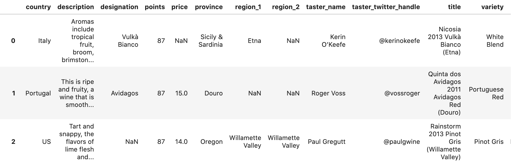

# Classifying Wine Varietals

## Motivation and Goals

In recent years, since moving a few blocks from a great wine store, I've become more and more interested in wine. I've always enjoyed trying new things and since I've been going to tastings I've been blown away by just how much different types of wine can vary. That said tasting notes have always seemed incredibly subjective to me, and I've always wondered how accurate you can really be in predicting a wine in a blind taste test. To that end I set out on this project to see how accurately a machine learning model could predict a varietal by tasting notes alone.

## The Data

The data was found on [kaggle](https://www.kaggle.com/zynicide/wine-reviews) and was originally sourced from [Wine Enthusiast](https://www.winemag.com/) via webscraping. The data is presented in 2 .csv files that on their face seem to contain 280 thousand reviews. However, due to the nature of the scraping algorithm used there are numerous duplicates within and between the two which, after elimination leave ~170 thousand unique reviews. For the time being most of the features in the data were dropped due to irrelevance to the immediate question.

The features of immediate interest kept were only 'description' and 'variety' containing the review with tasting notes and the variety of wine. All datapoints had a full description but a single datapoint did have a null value for variety and was dropped.

## Model Creation

## Next Steps