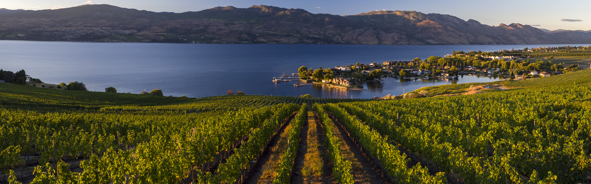
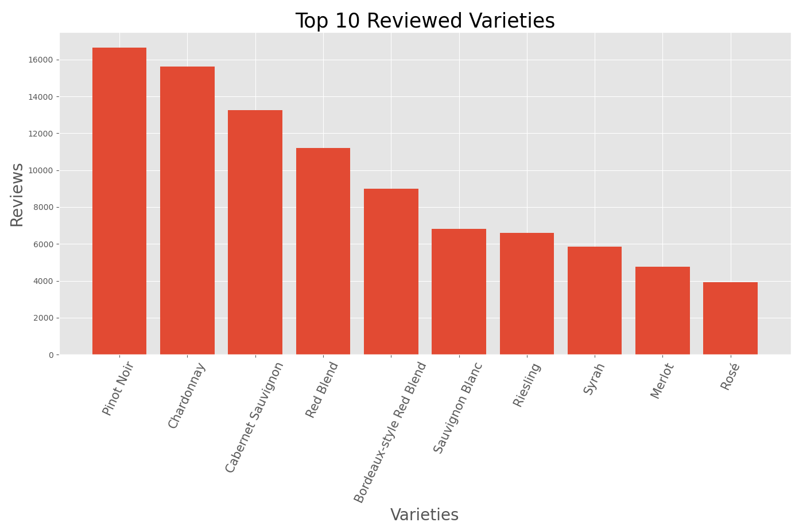
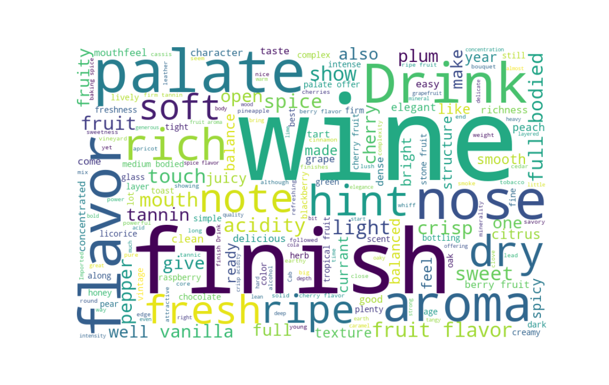

# Classifying Wine Varietals

## Motivation and Goals

In recent years, since moving a few blocks from a great wine store, I've become more and more interested in wine. I've always enjoyed trying new things and since I've been going to tastings I've been blown away by just how much different types of wine can vary. That said tasting notes have always seemed incredibly subjective to me, and I've always wondered how accurate you can really be in predicting a wine in a blind taste test. To that end I set out on this project to see how accurately a machine learning model could predict a varietal by tasting notes alone.

## The Data

The data was found on [kaggle](https://www.kaggle.com/zynicide/wine-reviews) and was originally sourced from [Wine Enthusiast](https://www.winemag.com/) via webscraping. The data is presented in 2 .csv files that on their face seem to contain 280 thousand reviews. However, due to the nature of the scraping algorithm used there are numerous duplicates within and between the two which, after elimination leave ~170 thousand unique reviews. For the time being most of the features in the data were dropped due to irrelevance to the immediate question.

| country | description | designation | points | price | province | region_1 | region_2 | taster_name |variety | winery |
|:---:|:---:|:---:|:---:|:---:|:---:|:---:|:---:|:---:|:---:|:---:|:---:|:---:|
| Italy | Aromas include tropical fruit, broom, brimstone and dried... | Vulkà Bianco | 87 | nan | Sicily & Sardinia | Etna | nan | Kerin O’Keefe | White Blend | Nicosia |
| Portugal | This is ripe and fruity, a wine that is smooth while still... | Avidagos | 87 | 15 | Douro | nan | nan | Roger Voss | Portuguese Red | Quinta dos Avidagos |
| US | Tart and snappy, the flavors of lime flesh and rind... | nan | 87 | 14 | Oregon | Willamette Valley | Willamette Valley | Paul Gregutt | Pinot Gris | Rainstorm |

The features of immediate interest kept were only 'description' and 'variety' containing the review with tasting notes and the variety of wine. All datapoints had a full description but a single datapoint did have a null value for variety and was dropped.

Initial EDA and research focused on the spread of varieties. Exploration of the descriptions will be discussed shortly in the section on featurization. One of the largest concerns in the varieties was the distribution of reviews. 756 varieties are reviewed in the data set but the majority of them have very little representation. Below you can see the top 10 most reviewed varieties.

After some debating I settled on a sub-sample of the top 15 most reviewed wines to move forward with for text featurization and model creation. The choice was based on a few factors but chief among them the top 15 included all varieties with more than 3,000 reviews and accounted for 65% or ~110 thousand datapoints from our original dataset. Furthermore the wines represented in the top 15 walk a line between diversity and similarity, issues addressed within just this sub-sample should hopefully be extendable to further varieties. Future investigation will require more data on these less represented wines. Below are the 15 wines used and their respective review counts.

| Wine | Reviews | Wine | Reviews | Wine | Reviews |
|:---:|:---:|:---:|:---:|:---:|:---:|
| Pinot Noir | 16651 | Chardonnay | 15625 |Cabernet Sauvignon | 13262 |
| Red Blend | 11214 | Bordeaux-style Red Blend | 8997 | Sauvignon Blanc |  6803 |
| Riesling | 6602 | Syrah | 5856 | Merlot | 4757 |
| Rosé | 3916 | Zinfandel | 3804 | Sangiovese | 3634 |  
| Malbec | 3439 | Nebbiolo | 3123 | White Blend | 3110 |

## Featurization

As with most NLP focused projects a large amount of effort has gone into featurizing the text, at this point in the project it's safe to say the majority of my time has gone to it. Immediate concerns I looked at were the relative length and complexity of reviews incase certain wines were discussed more per review than others. Thankfully for my purposes Wine Enthusiast likes to keep their reviews uniformly short and to the point, they all range from 3 to 4 short sentences.

Moving forward I spent a good deal of time dealing with stop words to remove from the reviews. I'm operating under the assumption that the main differentiating features in the reviews should be flavors and scents. To that end standard english stop words were sourced from NLTK. While looking at the reviews though I noticed a problem fairly quickly, many of them included the name of the varietal. To avoid data leakage all varietals present in the full dataset were added to the stop words. Running through with these stopwords I took a look at the most frequent words in order to get a sense of any others that should be eliminated.

## Model Creation

## Next Steps 